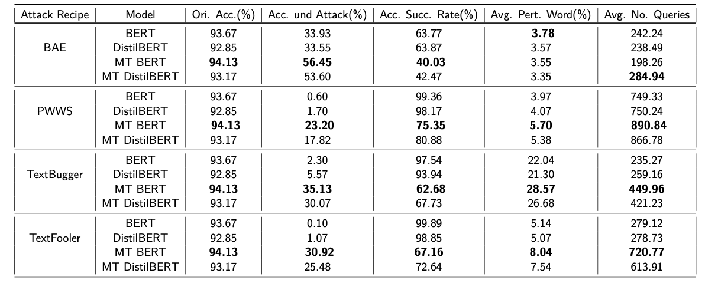
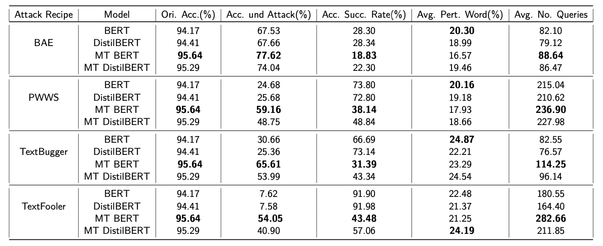

# Master Thesis
## Assessment of Mean Teacher and Prominent Adversarial Unlabeled Data for Language Classification

Language models has shown state-of-the-art performances in various natural lan- guage processing task. Recent research has shown their weakness against adversarial attacks, where imperceptible noise in text can lead model to behave unexpectedly and severely degraded their performance under attack. Furthermore, the research towards defensive mechanism is comparatively less studied topic than generating prominent adversarial attacks. In this master thesis, a semi-supervised approach of fine-tuning is proposed which can lead to robust language model without compromising with original accuracy. An experiment was conducted to compare the performance of model fine-tuned using conventional method and proposed method. The experiment was performed using BERT and DistilBERT language models on two datasets. As per experiment, the proposed approach demonstrated __0-2%__ and __20-30%__ improvement in original accuracy and accuracy under attacks over conventional method, respectively.

## Experiments Result

Table 1 . Experiment result of IMDB dataset. 

Table 2 . Experiment result of Covid-19 fake tweet dataset. 

## Dataset
1. Parth Patwa et al. “Fighting an Infodemic: COVID-19 Fake News Dataset”. In: [arXiv:2011.03327](https://arxiv.org/abs/2011.03327)(Mar. 2021). arXiv: 2011.03327 [cs].
2. Andrew L. Maas et al. “Learning Word Vectors for Sentiment Analysis”. In: Proceedings of the 49th Annual Meeting of the Association for Computational Linguistics: Human Lan- guage Technologies. Portland, Oregon, USA: Association for Computational Linguistics, June 2011. [paper](https://ai.stanford.edu/~ang/papers/acl11-WordVectorsSentimentAnalysis.pdf)

## Master Thesis Report 
[Project](https://github.com/bksaini078/Mean-Teacher-BERT-Robustness-Assessment)

## Author 
Bhupender Kumar Saini
## Under Supervision of 
Prof. Dr. Andreas Mauthe

Alexander Rosenbaum
